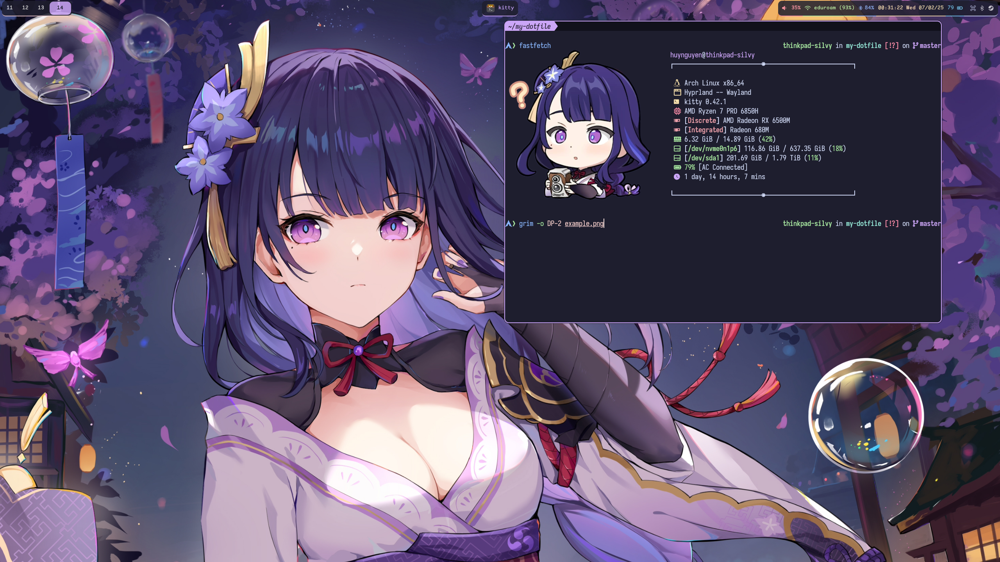

# My dotfiles

## What's in here?

- Dotfiles for my following programs
  - Neovim
  - Zsh
  - Tmux
  - kitty
  - sway
  - swaylock
  - wob
  - sov
  - workstyle
  - atuin
  - Vale

> [!NOTE]
> Technically VS Code is configured. But it's only a text file.
>

- 2 wallpapers I use. Mainly [this one](./wallpaper.png).

- For VS Code, since their extensions.json file contains some sensitive
info (aka, info about my directory structure), I will take the list of
extensions I currently have instead.
  - These extensions can be installed via the [convenience script](./vscode-install-extensions.sh)

## Dependencies

- These are (NeoVim) stuff that cannot be download through Lazy and/or Mason.
  - ccls (currently not in use)
  - clang/clang++
  - clang-tools-extra (optional)
  - npm
  - python3
  - python3-venv
  - python3-pip
